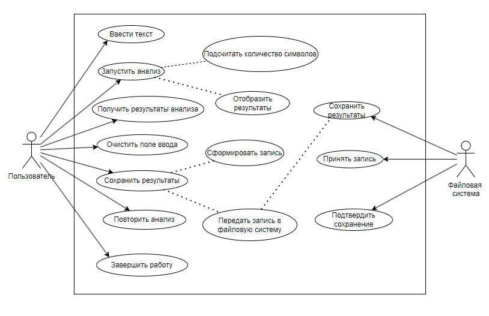
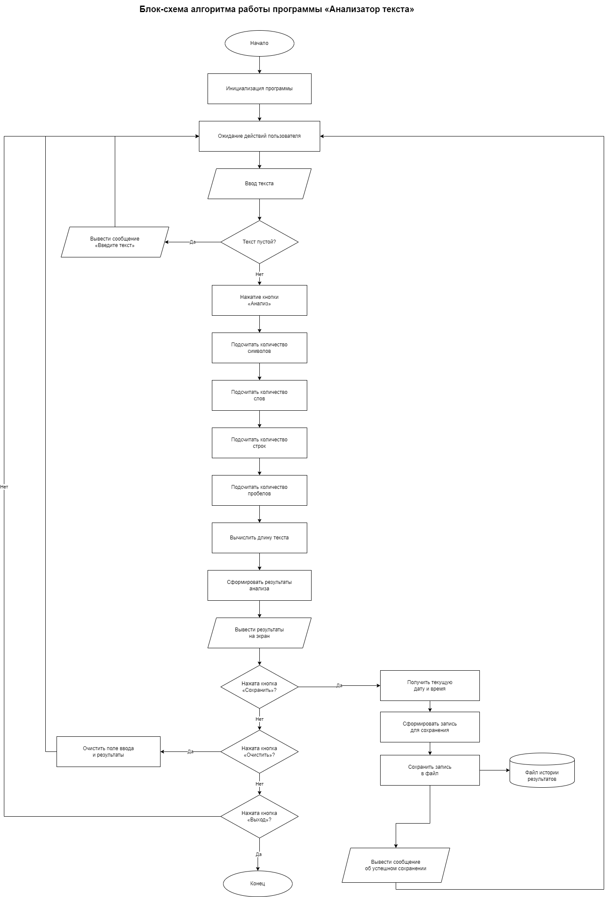

# Анализатор текста

## Описание проекта
Анализатор текста — это простая программа на Python с графическим интерфейсом на Tkinter. Она позволяет ввести любой текст и получить основные характеристики этого текста.

Программа считает:
- количество символов;
- количество слов;
- количество строк;
- количество пробелов.

Дополнительно результаты можно сохранить в файл `history.csv`. В файл записываются:
- дата и время анализа;
- длина текста;
- результаты анализа.

## Цели и задачи проекта

Цель

Создать простое и функциональное приложение для анализа текста, которое поможет пользователям быстро получать статистику по введенным данным и сохранять историю проверок.

Задачи, решаемые приложением

- Анализ текста: Подсчет ключевых метрик: символов, слов, строк и пробелов.
- Сохранение данных: Ведение истории анализов с привязкой ко времени в формате CSV.
- Удобство использования: Интуитивно понятный интерфейс с возможностью очистки полей ввода.

## Функции программы
1. Ввод текста в текстовое поле.
2. Анализ текста по нажатию кнопки.
3. Вывод результатов на экран.
4. Сохранение результатов в CSV-файл.
5. Очистка поля ввода.

## Используемые технологии
- Python
- Tkinter
- CSV

## Use Case схема


## Блок-схема программы


## Структура проекта
```text
Analiz/
├── main.py
├── README.md
├── history.csv
└── images/
    ├── use_case.png
    └── block_scheme.png
```

## Как запустить программу
1. Установить Python 3.
2. Скачать или открыть проект.
3. Запустить файл `main.py`.

Команда для запуска:
```bash
python main.py
```

## Как работает программа
1. Пользователь вводит текст.
2. Нажимает кнопку **«Анализировать»**.
3. Программа считает символы, слова, строки и пробелы.
4. Результаты выводятся в окне.
5. При нажатии **«Сохранить результат»** данные записываются в `history.csv`.

## Пример сохраняемых данных
```text
Дата;Длина текста;Символы;Слова;Строки;Пробелы
20.03.2026 14:30:10;120;120;18;4;17
```

## Вывод
Анализатор текста — это учебный проект с понятной логикой и удобным интерфейсом. Программа демонстрирует работу с графическим интерфейсом, обработкой строк и сохранением данных в файл.
